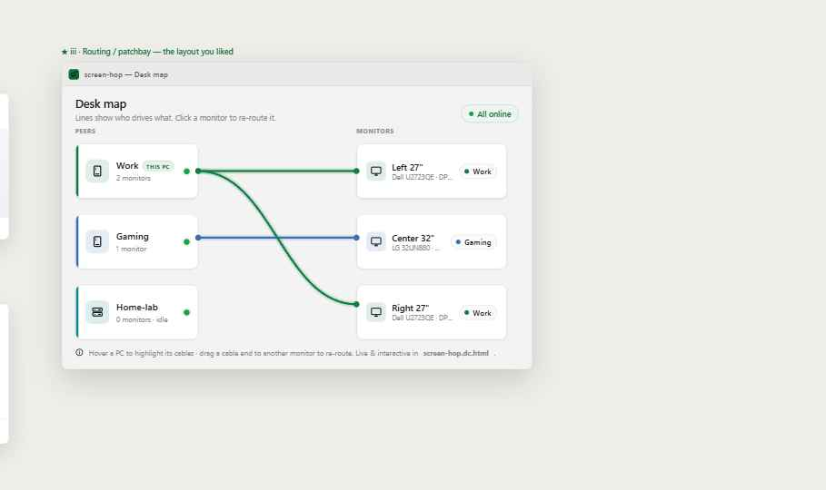

# screen-hop

**Reassign your desk's physical monitors between several PCs over the LAN — from a tray menu, in one
click, without reaching for each monitor's input-source button.**

[](https://github.com/cubukcum/screen-hop/actions/workflows/ci.yml)


<p align="center">
  <br>
  <em>Design preview — the desk-map / patchbay view. (UI is built as a Slint design layer; live
  binding to the backend is in progress — see <a href="#status">Status</a>.)</em>
</p>

---

## Why

If you run more than one PC at your desk — a work laptop, a personal tower, a home-server box — but
share one set of nice monitors between them, every switch means hunting for each monitor's physical
**input-source** button. screen-hop turns that into a single click from a tray menu: "give Monitor 2
to the laptop," and the right machine takes the panel.

It does this with **DDC/CI** — the same protocol your monitor's on-screen menu uses — to send an
**Input Select** command (VCP feature `0x60`) to whichever PC can physically drive that panel. No
KVM hardware, no extra cables, no cloud.

## How it works

- Each PC runs a small **tray agent**. The agents form a **serverless peer mesh** over the LAN
  (no central server, no coordinator election).
- When you reassign a monitor, the mesh routes the switch to the PC that can drive it. By default
  the **target** PC switches the monitor **to itself** ("pull-to-self" — the reliable direction).
- Ownership is then reconciled against the monitor's **live `0x60` value as ground truth**, so if
  someone presses the physical button, the UI catches up instead of lying to you.
- All mesh traffic is **encrypted + authenticated**, **LAN-only** (no WAN, no UPnP). See
  [Security](#security).

## Honest boundaries (please read first)

screen-hop is only as good as each monitor's DDC/CI implementation, and it is **deliberately honest**
about the limits:

- Behavior is **per-monitor** and must be discovered on real hardware (a built-in calibration step).
- It **cannot** touch BIOS / pre-OS / boot / lock screens — DDC/CI needs a running, logged-in session.
- Switching is **not instant** (~1–3 s, occasional retry) and is shown as progress, never faked.
- If the PC that must drive a panel is off/asleep, that monitor is **stranded** — there is no
  software recovery; the physical OSD button is the honest fallback, and the UI says so.
- Multi-monitor presets are **best-effort**, never atomic — per-monitor success/failure is surfaced.

## Status

This is a **pre-1.0, in-progress** project, built and developed in the open.

- ✅ **The core works on real hardware.** A tray click moves a shared monitor between two PCs —
  **both directions, over the LAN mesh** — verified on an AOC 27P2DG5 across a laptop (HDMI) and a
  desktop (DisplayPort) on 2026-06-30. mDNS discovery brings the two PCs up as "2 online" on a real
  LAN, and the switch fires real DDC/CI both ways.
- ✅ **The engine + agent are implemented and tested.** Domain core + soft-brick guard, monitor
  identity & calibration, the encrypted LAN mesh + discovery, orchestration (routing, presets,
  reconciliation, stranded / DDC-disabled / blind states), persistence, and the **live agent** that
  routes a tray click into a real DDC switch — **142 passing tests**, `cargo fmt` + `clippy -D
  warnings` clean, with CI (including a no-admin Windows installer build).
- 🚧 **Validated on one rig so far.** Still in progress: **broader hardware coverage** (more panels /
  GPUs), the rest of the in-window onboarding wizard (Step 1 pairing works; monitor-probe / calibrate
  / names steps still use `--calibrate` + design placeholders), the active-console-session guard,
  code-signing, and confirming CI on GitHub's runners. See
  [docs/REMAINING-CHECKLIST.md](docs/REMAINING-CHECKLIST.md).

The exact "done in code vs. needs verification" breakdown lives in
[docs/REMAINING-CHECKLIST.md](docs/REMAINING-CHECKLIST.md). The full product definition, architecture,
and decision log are in [docs/PLAN-screen-hop.md](docs/PLAN-screen-hop.md).

## Platforms

Cross-platform **Rust + [Slint](https://slint.dev)**, prioritized **Windows → Linux → macOS
(best-effort)**. The pure-logic crates build and test on any platform; DDC and UI need their
platform toolchains. macOS DDC is the most constrained (Apple Silicon drives panels over USB-C/TB
only; reads are unreliable).

## Build & run

Requires a recent stable Rust — **1.92+** (the floor is set by the Slint UI stack, not our own
code). CI builds and tests on current stable.

```sh
cargo build --workspace
cargo test  --workspace      # pure-logic crates; DDC/UI need their platform toolchains
```

**Try the hardware spike** (interactive; reads/writes a real monitor's input source — this is how you
answer "does my panel even cooperate?"):

```sh
cargo run -p screenhop-spike            # interactive menu
cargo run -p screenhop-spike -- list    # just enumerate panels
```

**Preview the UI surfaces** (renders a design surface to a window, or to a PNG for diffing):

```sh
cargo run -p screenhop-ui -- --screen deskmap --dark
cargo run -p screenhop-ui -- --shot out.png --screen flyout
```

**Run the agent** — calibrate once (with this PC shown on the panels), then go live. With the same
`mesh-secret` on each PC, a tray click moves a monitor between them:

```sh
cargo run -p screenhop-ui -- --calibrate   # learn this PC's input value per panel
cargo run -p screenhop-ui -- --live        # join the mesh + drive the tray
```

## Architecture

```
crates/
  screenhop-core/      domain types, MonitorDriver/Delayer/Clock traits, actuation state machine
  screenhop-ddc/       ddc-hi-backed MonitorDriver (Windows / Linux / macOS)
  screenhop-identity/  EDID fingerprint, collision/labeling, per-(peer,monitor) calibration
  screenhop-net/       AEAD transport (XChaCha20-Poly1305), Ed25519 handshake + TOFU pinning, wire schema
  screenhop-state/     per-monitor lease lock, last-writer-wins ownership map
  screenhop-quirks/    panel-global quirks DB (merge precedence user > local > shipped)
  screenhop-app/       mesh node + orchestration (discovery, routing, presets, reconcile, partition guard)
  screenhop-ui/        Slint tray UI surfaces + the backend-facing controller
  screenhop-spike/     M0 hardware feasibility spike (enumerate/read/write 0x60)
quirks/quirks.json     shipped community quirks DB
docs/                  plan, design handoff, hardware verdicts, contributor guides
```

## Security

A single shared **mesh secret** is stretched with **Argon2id** into a group key; **every** mesh
message is encrypted + authenticated with **XChaCha20-Poly1305**, with replay/sequence guards. Each
install has an **Ed25519 identity** pinned **trust-on-first-use**, so a changed key for a known peer
is refused. Control is **LAN / Private only** — no WAN, no UPnP. The threat model is
denial-of-visibility by an *unpaired* host on a personal LAN; an already-paired peer run by the same
operator is out of scope. Full model and the Windows/DPAPI re-pair caveat: [SECURITY.md](SECURITY.md).

To report a vulnerability, please follow [SECURITY.md](SECURITY.md) — not a public issue.

## Contributing & collaboration

**This is an open project and I'd genuinely welcome collaborators.** It's at the fun stage: the hard
architecture is done and tested, and what's left is high-impact, well-scoped work. If any of this
sounds like you, please open an issue or a discussion to say hi:

- 🖥️ **Hardware testers** — run the spike on your monitors and contribute a one-line verdict + a
  panel quirk. This is the single most valuable thing: screen-hop's reliability is *defined* by
  real-panel data. See [docs/contributing-quirks.md](docs/contributing-quirks.md).
- 🎨 **Slint / UI** — wire the tray surfaces to the backend `Controller` and the live mesh loop
  (the biggest remaining code task).
- 📦 **Packaging** — Windows installer (Inno) + Scheduled-Task autostart, code-signing, CI release.
- 🦀 **Rust** — pick anything from [docs/REMAINING-CHECKLIST.md](docs/REMAINING-CHECKLIST.md).

Start with [CONTRIBUTING.md](CONTRIBUTING.md) for build/test, the CI gates, and the workspace map.
Good first contributions are panel quirks and small, well-tested fixes. Be kind, be honest about
hardware limits (it's the whole ethos here), and have fun.

## License

Licensed under the **MIT License** — see [LICENSE](LICENSE). Contributions are accepted under MIT.
